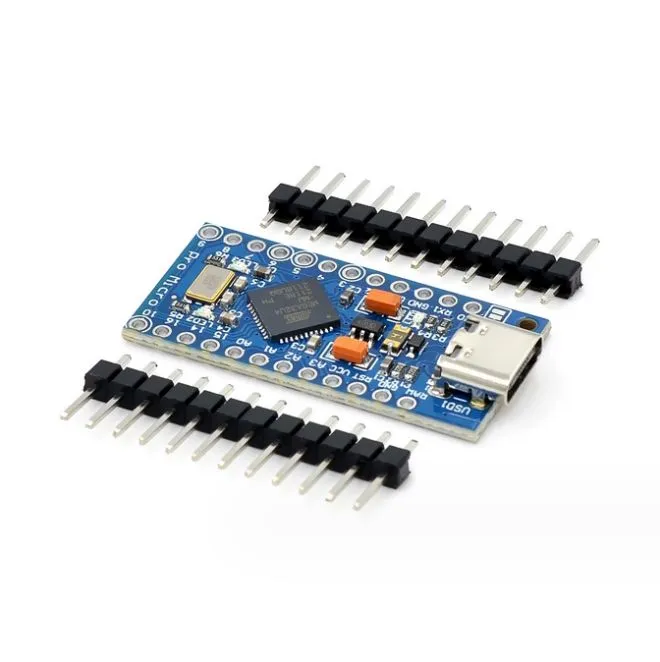
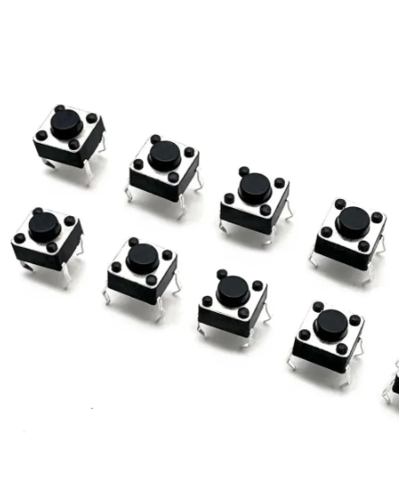
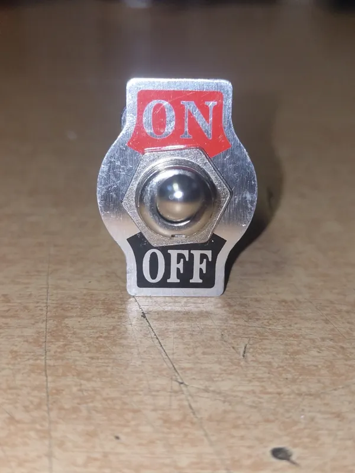
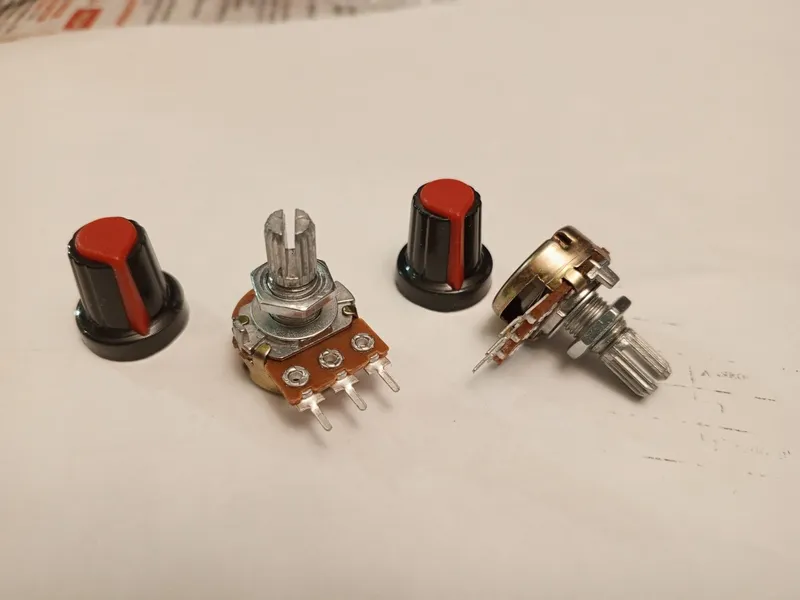
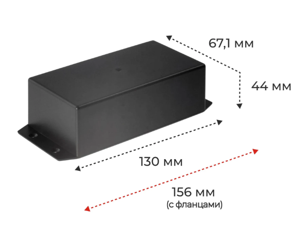

# Button Box

## Прошивка

- Сборка: `pio run`
- Заливка: `pio run -t upload`
- Список портов: `pio device list`
- Монитор порта: `pio device monitor --port COMXX --baud 115200`
- Два пота (**A0**, **A1**): значения в Serial **раз в 5 с** (см. `kPotLogIntervalMs` в `src/main.cpp`).

## Windows: переключение мониторов

1. Установить [AutoHotkey v2](https://www.autohotkey.com/).
2. Запустить файл `display-switch.ahk`.

## Автозапуск (Windows)

1. Нажать `Win + R`.
2. Ввести `shell:startup`.
3. Нажать Enter.
4. Добавить в открывшуюся папку ярлык на `display-switch.ahk`.

## Назначение кнопок (прошивка + `display-switch.ahk`)

- **Кнопка 1** (пин 6) -> `Ctrl+Alt+1` -> только экран ПК (`DisplaySwitch /internal`)
- **Кнопка 2** (пин 7) -> `Ctrl+Alt+4` -> только внешний монитор (`DisplaySwitch /external`)

На ПК должен быть запущен `display-switch.ahk` (см. выше). Кнопки **3–5** в прошивке пока только пишут события в Serial.

## Сводная таблица запчастей

| Название                                                        | Количество | Изображение |
| --------------------------------------------------------------- | ---------- | ----------- |
| Arduino Pro Micro (ATmega32U4, 5 В, 16 МГц)                     | 1          |  |
| Тактовая кнопка (на пин и GND, в прошивке — подтяжка к питанию) | 5          |  |
| Тумблер **ON–OFF** (два вывода, как простой выключатель / SPST) | 2          |  |
| Потенциометр линейный (три вывода: GND, сигнал, 5 V)            | 2          |  |
| Корпус (бокс)                                                   | 1          |  |

## Подключение к Pro Micro

Общий **GND** — второй контакт у кнопок и тумблеров; у пота один край на **GND**, другой на **5 V** с платы.

| Что            | Пин Arduino      | Куда второй провод / крайние ноги пота                                                 |
| -------------- | ---------------- | -------------------------------------------------------------------------------------- |
| Кнопки 1 … 5   | **6** … **10**   | **GND**                                                                                |
| Пот 1          | **A0** — средняя | крайние → **GND** и **5 V** (края можно поменять местами — меняется направление шкалы) |
| Пот 2          | **A1** — средняя | крайние → **GND** и **5 V** (те же шины, что у пота 1)                                 |
| Тумблеры 1 и 2 | **14**, **15**   | **GND**                                                                                |

Оба пота в прошивке: в Serial **раз в 5 с** подряд две строки — `pot 1 pin A0 …` и `pot 2 pin A1 …` (`kPotLogIntervalMs`).

Кнопки и тумблеры: в коде **подтяжка к 5 V** (`INPUT_PULLUP`), замыкание на землю = нажато / «вкл».

Номера пинов — как в Arduino; на клонах Pro Micro надписи на плате могут не совпадать.

