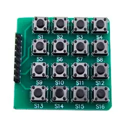
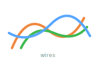
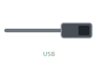

# Button Box

## Прошивка

- Сборка: `pio run`
- Заливка: `pio run -t upload`
- Список портов: `pio device list`
- Монитор порта: `pio device monitor --port COMXX --baud 115200`

## Windows: переключение мониторов

1. Установить [AutoHotkey v2](https://www.autohotkey.com/).
2. Запустить файл `display-switch.ahk`.

## Автозапуск (Windows)

1. Нажать `Win + R`.
2. Ввести `shell:startup`.
3. Нажать Enter.
4. Добавить в открывшуюся папку ярлык на `display-switch.ahk`.

## Назначение кнопок

- `1` -> `Ctrl+Alt+1` -> `DisplaySwitch /internal` (только экран ПК)
- `2` -> `Ctrl+Alt+2` -> `DisplaySwitch /clone` (дублировать)
- `3` -> `Ctrl+Alt+3` -> `DisplaySwitch /extend` (расширить)
- `A` -> `Ctrl+Alt+4` -> `DisplaySwitch /external` (только внешний экран)

## Подключение

- `R1 -> 2`
- `R2 -> 3`
- `R3 -> 4`
- `R4 -> 5`
- `C1 -> 6`
- `C2 -> 7`
- `C3 -> 8`
- `C4 -> 9`

## Сводная таблица запчастей

| Название | Количество | Изображение |
|----------|:----------:|-------------|
| Arduino Pro Micro (ATmega32U4, 5 В, 16 МГц), плата как в `platformio.ini` (`sparkfun_promicro16`) | 1 |  |
| Матричная клавиатура 4×4 (мембранная или модуль с выводами строк/столбцов) | 1 |  |
| Провода для соединения (например, Dupont «мама–мама» или пайка) | 8+ |  |
| USB-кабель к плате (Micro-USB или USB-C — по разъёму вашей Pro Micro) | 1 |  |
